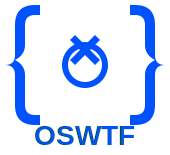

<p align="center">
  
</p>

<h1 align="center">🥋 Dojo Skills Registry</h1>

<p align="center">
  <strong>The canonical skill registry for <a href="https://github.com/OpenSourceWTF/dojo">Dojo</a> — a package manager for AI agent skills and workflows.</strong>
</p>

<p align="center">
  <a href="https://github.com/OpenSourceWTF/dojo-skills/blob/main/LICENSE"></a>
  <a href="https://github.com/OpenSourceWTF/dojo-skills"></a>
  
  
</p>

<p align="center">
  <a href="https://github.com/OpenSourceWTF">
    
  </a>
  <br>
  <sub>An <a href="https://github.com/OpenSourceWTF">OpenSourceWTF</a> Project</sub>
</p>

---

## ⚡ Quick Start

```bash
# Install a skill
dojo learn @anthropic/frontend-design

# Search for skills  
dojo search "testing"

# List installed skills
dojo list
```

---

## 🎯 Supported Platforms

<table>
  <tr>
    <td align="center"></td>
    <td align="center"></td>
    <td align="center"></td>
  </tr>
  <tr>
    <td align="center"></td>
    <td align="center"></td>
    <td align="center"></td>
  </tr>
</table>

---

## 📁 Registry Structure

```
registry/
├── 🏢 official/                    # Vendor-maintained skills
│   ├── anthropic.json              # Claude skills (17)
│   ├── google.json                 # Gemini skills (10)
│   └── openai.json                 # Codex skills (6)
│
├── 🌐 community/                   # Community-curated  
│   └── awesome.json                # Curated skills (17)
│
├── 🔌 mcp/                         # MCP servers by vendor
│   ├── modelcontextprotocol.json   # Official MCP (13)
│   ├── github.json                 # GitHub MCP (1)
│   ├── upstash.json                # Context7 (1)
│   ├── opensourcewtf.json          # Dojo (1)
│   └── community.json              # Community (5)
│
├── 🖱️ cursor/                      # Cursor AI rules
│   ├── patrickjs.json              # awesome-cursorrules (11)
│   └── instructa.json              # AI prompts (1)
│
└── 👤 user/                        # Local-only (gitignored)
```

---

## 📊 Skill Categories

| Category | Description | Count |
|:--------:|-------------|:-----:|
| 📄 **Document** | Office docs, PDFs, file formats | 8 |
| 🎨 **Design** | Visual design, creative coding | 12 |
| 💻 **Development** | Coding patterns, testing, builds | 24 |
| 🔌 **MCP** | Model Context Protocol servers | 21 |
| 🔧 **Productivity** | Workflows, automation | 6 |
| 🖱️ **Cursor** | Cursor AI rules & prompts | 12 |

---

## 📝 Skill Schema

<details>
<summary><strong>Click to expand JSON schema</strong></summary>

```json
{
  "skills": {
    "skill-id": {
      "name": "Display Name",
      "source": "github:org/repo/path",
      "aliases": ["alias1", "alias2"],
      "description": "What the skill does",
      "tags": ["category1", "category2"],
      "dependencies": ["@org/dep-skill"],
      "versions": {
        "1.0.0": "commit-hash",
        "latest": "main"
      },
      "mcp_servers": [
        {
          "name": "server-name",
          "package": "@scope/package",
          "command": "npx",
          "args": ["-y", "@scope/package"],
          "env": { "API_KEY": "" }
        }
      ]
    }
  }
}
```

</details>

### Required Fields

| Field | Description |
|-------|-------------|
| `name` | Human-readable display name |
| `source` | GitHub path: `github:owner/repo/path` |
| `aliases` | Short names for quick lookup |
| `description` | One-line description |
| `tags` | Categories for filtering |

### Optional Fields

| Field | Description |
|-------|-------------|
| `dependencies` | Skills this depends on |
| `versions` | Version-to-commit mapping |
| `mcp_servers` | MCP server auto-configuration |

---

## 🔍 Resolution Logic

```
┌─────────────────────────────────────────────────────┐
│  1. Fully Qualified Names (FQN)                     │
│     @anthropic/docx  →  Direct match               │
├─────────────────────────────────────────────────────┤
│  2. Short Name Search                              │
│     "pdf"  →  Searches all registry files          │
├─────────────────────────────────────────────────────┤
│  3. Collision Handling                             │
│     Multiple matches  →  Prompts user for FQN      │
├─────────────────────────────────────────────────────┤
│  4. Priority Order                                 │
│     Official > Community > User                    │
└─────────────────────────────────────────────────────┘
```

---

## 🤝 Contributing

1. **Fork** this repository
2. **Add** your skill to `registry/community/awesome.json`
3. **Follow** the JSON schema above
4. **Submit** a PR with:
   - Skill description
   - Source repository link
   - Example use cases

---

## 📚 Sources

<details>
<summary><strong>Official Sources</strong></summary>

| Repository | Platform | Count |
|------------|----------|:-----:|
| [anthropics/skills](https://github.com/anthropics/skills) | Claude, Gemini | 17 |
| [google-gemini/gemini-cli](https://github.com/google-gemini/gemini-cli) | Gemini, Claude | 10 |
| [openai/codex](https://github.com/openai/codex) | Codex, all | 6 |

</details>

<details>
<summary><strong>Community Sources</strong></summary>

| Repository | Platform | Count |
|------------|----------|:-----:|
| [obra/superpowers](https://github.com/obra/superpowers) | Claude, Gemini | 2 |
| [kepano/obsidian-skills](https://github.com/kepano/obsidian-skills) | All | 1 |
| [PatrickJS/awesome-cursorrules](https://github.com/PatrickJS/awesome-cursorrules) | Cursor | 11 |
| Various community | All | 15+ |

</details>

<details>
<summary><strong>MCP Server Sources</strong></summary>

| Repository | Count |
|------------|:-----:|
| [modelcontextprotocol/servers](https://github.com/modelcontextprotocol/servers) | 13 |
| [github/github-mcp-server](https://github.com/github/github-mcp-server) | 1 |
| [upstash/context7](https://github.com/upstash/context7) | 1 |
| Community MCP servers | 6 |

</details>

---

<p align="center">
  <sub>
    <strong>Total Skills: 83</strong> · 
    <strong>MCP Servers: 21</strong> · 
    <strong>Last Updated: 2026-01-13</strong>
  </sub>
</p>

<p align="center">
  <a href="LICENSE">MIT License</a> · 
  <a href="https://github.com/OpenSourceWTF/dojo">Dojo CLI</a> · 
  <a href="https://github.com/OpenSourceWTF">OpenSourceWTF</a>
</p>
